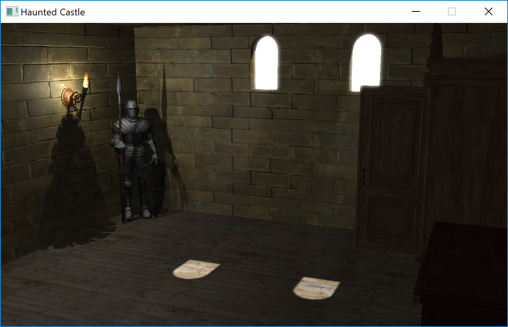

# EZG18 - Haunted Castle
 <> Brief description of the implementation, in particular a short description of how the different aspects of the requirements (see above) were implemented - be specific, but keep it concise.
## Story
The user finds herself/himself in a medieval dark room and can barely identify the objects around him/her. Suddenly torches catch fire as if by ghost hand. He/She takes a look around the room and sees different things moving: A chair that is moving forward, chess figure starting moving, torches move to an upright position and paintings falling down. All ends with the wardrobe falling on the user.

## Scene
Medieval room with torches on fire, knight armors, chairs with chess desk, stone walls, paintings and closet.

## CONTROLS

### ALWAYS AVAILABLE

Key(s) | control
--- | ---
F1 | Help / Show Controls
F2 | Frame Time on/off
+/- | Ambient Light up/down
Page up/Page down/Pos1 | Speed up/down/reset
C| Debug Mode on/off
ESC | Quit Game

### JUST IN DEBUG MODE

Key(s) | control
--- | ---
F3 | Wire Frame on/off
F4 | Textur-Sampling-Quality: Nearest Neighbor/Bilinear
F5 | Mip Mapping-Quality: Off/Nearest Neighbor/Linear
F6 | Viewfrustum-Culling on/off
F7 | Normal Mapping on/off
F8 | Fire and Shadows 1 on/off
F9 | Fire and Shadows 2 on/off
F10 | Bloom on/off
F11 | Light Shafts on/off
W, ARROW UP | Accelerate
S, ARROW DOWN | Decelerate/Backwards
A, ARROW LEFT, MOUSE DRAG RIGHT | Pan left
D, ARROW RIGHT, MOUSE DRAG LEFT | Pan right
Q | Go down
E | Go up
MOUSE DRAG UP | Camera down
MOUSE DRAG DOWN | Camera up

## DEVELOPMENT STATUS
Implemented:
- [Bling-Phong illumination model](https://en.wikipedia.org/wiki/Blinn%E2%80%93Phong_shading_model)
- Loading all [models](#Models) with textures
- Debug camera ([Controls](#CONTROLS) see above)
- Camera Path ([Cubic Hermite](https://en.wikipedia.org/wiki/Cubic_Hermite_spline))
- All [Effects](#EFFECTS) (See below)

## EFFECTS
<> TODO How you've implemented those Effects (Links/References to papers, books or other resources where the effect is described and a description of your extensions to it)

- Direction shadows with PCF (from the sun)
  - https://learnopengl.com/Advanced-Lighting/Shadows/Shadow-Mapping

- Bloom (Bright Window)
  - http://learnopengl.com/#!Advanced-Lighting/Bloom

- Fire (Particle Effect)
  - Revision Course Slides: Particle Systems (2018W)
  - Revision Course Slides: Particle Systems (2018W)

- Omnidirectional Shadows (Shadows of Torches)
  - Revision Course Slides: Omnidirectional Shadows (2018W)

- Bump Mapping (Wall)
  - Kilgard, M. J. (2000, July). A practical and robust bump-mapping technique for today’s GPUs. In Game Developers Conference 2000 (pp. 1-39). https://www.cg.tuwien.ac.at/courses/Realtime/slides/VU.WS.2013/PracticalBumpMap.pdf

- Volumetric Lighting (Light Rays from Sun)
  - Revision Course Slides: Volumetric Lighting (2018W)

## IMPLEMENTATION DETAILS
### Requirements
- Windows
- OpenGL 3.3 Core Profile
- NVIDIA GTX 1060 (Tested on AMAROK PC in VisLab)

### Tools
- Visual Studios 2013
- Blender: https://www.blender.org/
- HitFilm Express: https://fxhome.com/express

### Libraries used
- Assimp: http://www.assimp.org/
- FreeImage: http://freeimage.sourceforge.net/
- Glew: http://glew.sourceforge.net/install.html
- PhysX: https://developer.nvidia.com/physx-sdk
- fmod: https://www.fmod.com/

### Models
- Chessboard with figures: https://free3d.com/3d-model/chess-table-18114.html
- Chest of drawers: https://www.turbosquid.com/3d-models/free-sideboard-3d-model/558818
- Frame: https://free3d.com/3d-model/frame-75994.html
- Knight1 and Knight2: https://free3d.com/3d-model/knight-84265.html
- Door: https://free3d.com/3d-model/medieval-door-16986.html
- Torches: https://www.yobi3d.com/q/3d-models-fire-torch
- Wardrobe: https://www.turbosquid.com/3d-models/classic-wardrobe-unwrap-model-1288182
- Chairs: https://www.turbosquid.com/3d-models/free-wooden-chair-3d-model/791045
- Table: https://free3d.com/3d-model/round-table-928375.html

### Additional Textures
- Walls of Room: Stone(1)01 from https://www.cg.tuwien.ac.at/courses/Textures/Total_Textures_V1/
- Ceiling of Room: Wood(2)09 from https://www.cg.tuwien.ac.at/courses/Textures/Total_Textures_V1/
- Floor of Room: Wood(2)10 from https://www.cg.tuwien.ac.at/courses/Textures/Total_Textures_V1/
- Frame Image: https://dermeister.at/evilmaster01.jpg

### Music
- Spooky Music Instrumental - Ravensbrook: https://www.youtube.com/watch?v=H9D8fAC6CoU
- Sound Effects: https://freesound.org

## VIDEO
Coming soon

## Authors
* Michael Pointner
* Simon Reisinger
